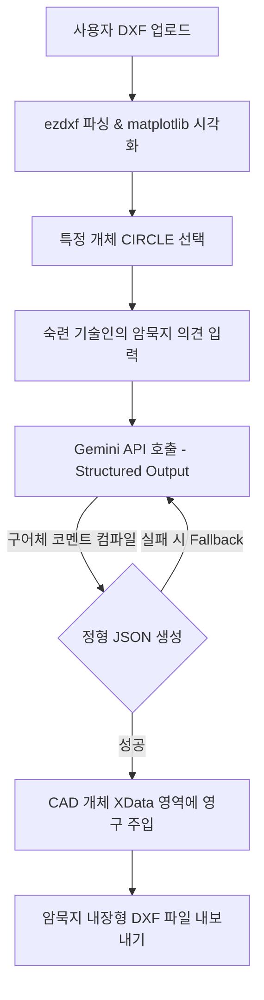

# 🛠️ TacitBridge-DXF

[](https://www.python.org/)
[](LICENSE)
[](https://streamlit.io/)
[](https://ai.google.dev/)
[](https://ezdxf.readthedocs.io/)

**TacitBridge-DXF**는 **암묵지 내장형 2D DXF 도면 편집기 및 뷰어**입니다. 

> [!WARNING]
> 본 프로젝트는 **개인이 학습용으로 개발 중인 테스트 데모 버전**입니다. 더 나은 도구를 만들기 위해 열심히 연습하고 고민하는 단계이므로, 실제 실무나 상용 환경에 적용하기보다 **단순 참고용으로만 활용**해주시기 바랍니다. 설계 및 개발 과정에서 **AI(Generative AI)를 적극 활용**하여 구현하였습니다.

현장 숙련 기술인들의 직관과 노하우(구어체 의견)를 최신 **Google Gemini AI**를 통해 정형화된 JSON 형태의 설계 제약조건 규칙으로 변환하고, 이를 2D CAD 도면(DXF) 내의 특정 개체(Entity)에 **Extended Data (XData)** 형식으로 영구 주입 및 보존할 수 있도록 지원합니다.

---

## 📌 목차
1. [핵심 기능](#-핵심-기능)
2. [시스템 아키텍처 및 동작 원리](#-시스템-아키텍처-및-동작-원리)
3. [기술 스택](#-기술-스택)
4. [디렉토리 구조](#-디렉토리-구조)
5. [설치 및 준비 사항](#-설치-및-준비-사항)
6. [사용 방법](#-사용-방법)
   - [Web UI (Streamlit)](#1-web-ui-streamlit-실행)
   - [Desktop GUI (Tkinter)](#2-desktop-gui-tkinter-실행)
7. [주요 소스코드 핵심 요약](#-주요-소스코드-핵심-요약)
8. [라이선스](#-라이선스)

---

## 🌟 핵심 기능

*   **2D DXF 도면 로드 & 인터랙티브 시각화**: `ezdxf`와 `matplotlib`를 통해 도면 형상(LINE, CIRCLE)을 정확하게 렌더링하고, 원하는 영역을 선택할 수 있습니다.
*   **다양한 UI 모드 지원**:
    *   **반응형 웹 UI (Streamlit)**: 간편하게 브라우저 상에서 도면 분석, 노하우 주입 및 가상 좌표 검색을 수행합니다.
    *   **데스크톱 GUI (Tkinter)**: 드래그 영역 선택(다중 스냅), Ctrl 키 다중 선택 토글, 이미 노하우가 내장된 개체(녹색 실선)의 리스트업 및 더블클릭 스냅 기능 등 향상된 뷰어 환경을 제공합니다.
*   **Gemini AI 기반 암묵지 컴파일**: 기술인의 구어체 코멘트(예: *"크랙 안나게 외경 살두께의 1.5배로 키워야 됨"*)를 분석하여, 컴퓨터가 이해할 수 있는 형태의 정형 JSON 규칙으로 변환합니다.
*   **Gemini API Fallback 시스템**: 최신 `gemini-2.5-flash` 모델을 기본으로 하되, API 권한/할당량 이슈 발생 시 `gemini-1.5-flash` ➡️ `gemini-2.5-pro` ➡️ `gemini-1.5-pro` 순으로 자동 대체 구동(Fallback)되어 안정적인 API 호출을 유지합니다.
*   **XData(Extended Data) 영구 주입**: ezdxf API를 사용해 CAD 원형 개체의 고유 ID(Handle)에 직접 JSON 제약조건 규칙을 내장(`TACIT_BRIDGE` AppID 사용)시켜 내보냅니다.
*   **실시간 모니터링 및 로깅**: `RotatingFileHandler`를 활용해 앱 구동 상태와 API 연동 내용을 안전하게 파일로 기록하고, 화면에 실시간 트레이스를 노출합니다.

---

## ⚙️ 시스템 아키텍처 및 동작 원리



---

## 🛠️ 기술 스택

*   **Language**: Python 3.8+
*   **CAD Parsing**: [ezdxf](https://ezdxf.readthedocs.io/)
*   **Visualization**: [matplotlib](https://matplotlib.org/)
*   **LLM Service**: [google-genai](https://pypi.org/project/google-genai/) (Google GenAI SDK)
*   **UI Frameworks**: [Streamlit](https://streamlit.io/) (Web), Tkinter (Desktop GUI)
*   **Logging**: Python `logging` (RotatingFileHandler)

---

## 📂 디렉토리 구조

```text
tacit_knowledge_open/
├── .gitignore
├── requirements.txt
├── run.bat                 # Web UI 간편 실행 배치 스크립트
├── run_gui.bat             # Desktop GUI 간편 실행 배치 스크립트
├── src/
│   ├── app.py              # Streamlit 웹 UI 메인 스크립트
│   ├── app_gui.py          # Tkinter 데스크톱 GUI 메인 스크립트
│   ├── infrastructure/
│   │   ├── __init__.py
│   │   └── file_repo.py    # 파일 입출력 및 DXF 저장 리포지토리
│   ├── services/
│   │   ├── __init__.py
│   │   ├── gemini_service.py   # Gemini API 연동 및 제약조건 컴파일
│   │   ├── geometry_service.py # ezdxf 기반 기하 형상 분석 및 공간 매핑
│   │   └── xdata_service.py    # DXF Extended Data (XData) 제약조건 주입/추출
│   └── utils/
│       ├── __init__.py
│       └── logger.py       # Rotating File Logger & GUI 연동 로깅 유틸
└── temp/                   # 임시 파일 저장 공간 (자동 생성)
```

---

## 📥 설치 및 준비 사항

### 1. 가상환경 및 의존성 라이브러리 설치
프로젝트 루트 폴더에서 아래 명령어를 실행하여 의존성 라이브러리를 설치합니다.
```bash
# 가상환경 생성 (권장)
python -m venv venv

# 가상환경 활성화 (Windows 기준)
.\venv\Scripts\activate

# 의존성 패키지 설치
pip install -r requirements.txt
```

### 2. Gemini API 키 설정
구글 Gemini API를 사용하기 위해 API 키가 필요합니다.
두 가지 방법 중 하나를 선택하여 키를 제공할 수 있습니다:
1.  **환경변수 등록 (권장)**: 운영체제 시스템 환경변수에 `GEMINI_API_KEY`라는 이름으로 발급받은 API 키를 등록합니다.
2.  **UI 직접 입력**: 애플리케이션의 설정/사이드바 입력란에 직접 API 키를 기입하여 임시로 사용할 수 있습니다.

---

## 🚀 사용 방법

### 1. Web UI (Streamlit) 실행
웹 환경에서 가볍고 세련된 대화형 화면으로 사용하려면 아래 스크립트를 작동합니다.
*   **배치 파일 실행**: 루트 디렉토리의 [run.bat](file:///C:/Users/hwang/OneDrive/%EB%AC%B8%EC%84%9C/Python%20Scripts/tacit_knowledge_open/run.bat) 더블 클릭
*   **혹은 CLI 실행**:
    ```bash
    streamlit run src/app.py
    ```

#### 웹 화면 동작 흐름:
1.  사이드바에서 Gemini API 키를 확인/입력합니다.
2.  분석할 2D DXF 파일을 업로드합니다.
3.  좌측 도면 뷰어에서 빨갛게 하이라이트할 타겟 개체를 사이드바의 드롭다운 혹은 가상 클릭 좌표(X, Y)로 선택합니다.
4.  우측 입력란에 숙련 기술인의 코멘트를 자연어로 입력한 뒤 **"Gemini AI 제약조건 분석 및 컴파일"** 버튼을 클릭합니다.
5.  컴파일된 JSON 구조를 확인하고, **"도면에 메타데이터 영구 주입"** 버튼을 누른 후 생성된 **"암묵지 내장형 DXF 다운로드"** 버튼을 클릭하여 저장합니다.

---

### 2. Desktop GUI (Tkinter) 실행
드래그를 통한 다중 선택, Snap 이동, 도면 내 저장된 지식 목록 조회 등 확장된 엔지니어링 기능을 사용하려면 데스크톱 버전을 실행합니다.
*   **배치 파일 실행**: 루트 디렉토리의 [run_gui.bat](file:///C:/Users/hwang/OneDrive/%EB%AC%B8%EC%84%9C/Python%20Scripts/tacit_knowledge_open/run_gui.bat) 더블 클릭
*   **혹은 CLI 실행**:
    ```bash
    python src/app_gui.py
    ```

#### 데스크톱 화면 동작 흐름:
*   **도면 드래그 및 복수 선택**: 도면 영역에서 마우스를 드래그하여 영역 내 원형 개체를 일괄 선택할 수 있습니다. `Ctrl` 키를 누른 상태에서 드래그/클릭 시 기존 선택에 누적으로 추가됩니다.
*   **내장 노하우 자동 탐지**: 설계 노하우가 주입된 개체는 도면상에 **녹색 실선**으로 차별화되어 표현됩니다.
*   **설계 노하우 조회 및 스냅**: **"설계 노하우 조회"** 탭을 클릭하면 도면에 이미 각인되어 있는 노하우 목록을 한눈에 볼 수 있습니다. 리스트의 행을 선택하거나 더블클릭하면 해당 개체로 도면의 중심이 자동 이동(Snap)됩니다.
*   **일괄 저장**: 선택 영역에 대해 노하우를 기입하고 **"분석 결과 주입 및 도면 저장"**을 클릭하면, 선택된 전체 개체에 동일한 제약 규칙이 동시 주입된 후 일괄 내보내기가 실행됩니다.

---

## 🔍 주요 소스코드 핵심 요약

### 1. Gemini AI 제약조건 컴파일 서비스 ([gemini_service.py](file:///C:/Users/hwang/OneDrive/%EB%AC%B8%EC%84%9C/Python%20Scripts/tacit_knowledge_open/src/services/gemini_service.py))
최신 `google-genai` 라이브러리를 이용하여 `response_mime_type="application/json"` 모드로 AI에 JSON 구조화를 강제하며, 모델 가용성 및 호출 에러에 대응하기 위한 Fallback 및 Exponential Backoff 알고리즘이 완비되어 있습니다.

### 2. CAD Extended Data 제약조건 주입/추출 ([xdata_service.py](file:///C:/Users/hwang/OneDrive/%EB%AC%B8%EC%84%9C/Python%20Scripts/tacit_knowledge_open/src/services/xdata_service.py))
`ezdxf` 라이브러리를 활용해 고유한 Application ID (`TACIT_BRIDGE`)로 XData 태그 리스트(Group Code `1001` 및 `1000` 문자열 데이터)를 CAD 엔티티 데이터베이스에 안전하게 쓰고 읽어옵니다.

### 3. 기하 도형 정보 처리 ([geometry_service.py](file:///C:/Users/hwang/OneDrive/%EB%AC%B8%EC%84%9C/Python%20Scripts/tacit_knowledge_open/src/services/geometry_service.py))
모델 스페이스에서 원형(`CIRCLE`) 개체를 선별하고, 사용자가 입력한 가상 클릭 2D 좌표와 기하 도형 사이의 Euclidean Distance를 계산하여 임계값 내 최단 거리 개체를 탐색해 냅니다.

---

## 📄 라이선스

본 프로젝트는 **MIT 라이선스(MIT License)** 하에 배포됩니다.

```text
Copyright (c) 2026 hwangsk83

Permission is hereby granted, free of charge, to any person obtaining a copy
of this software and associated documentation files (the "Software"), to deal
in the Software without restriction, including without limitation the rights
to use, copy, modify, merge, publish, distribute, sublicense, and/or sell
copies of the Software, and to permit persons to whom the Software is
furnished to do so, subject to the following conditions:

The above copyright notice and this permission notice shall be included in all
copies or substantial portions of the Software.

THE SOFTWARE IS PROVIDED "AS IS", WITHOUT WARRANTY OF ANY KIND, EXPRESS OR
IMPLIED, INCLUDING BUT NOT LIMITED TO THE WARRANTIES OF MERCHANTABILITY,
FITNESS FOR A PARTICULAR PURPOSE AND NONINFRINGEMENT. IN NO EVENT SHALL THE
AUTHORS OR COPYRIGHT HOLDERS BE LIABLE FOR ANY CLAIM, DAMAGES OR OTHER
LIABILITY, WHETHER IN AN ACTION OF CONTRACT, TORT OR OTHERWISE, ARISING FROM,
OUT OF OR IN CONNECTION WITH THE SOFTWARE OR THE USE OR OTHER DEALINGS IN THE
SOFTWARE.
```
